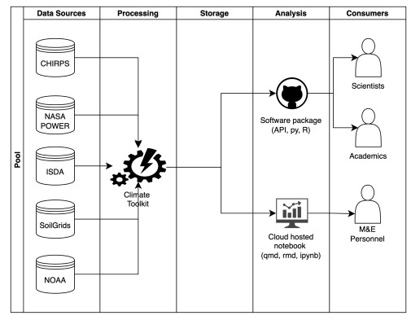
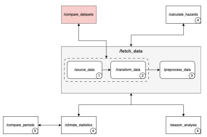

# Climate Data Toolkit

A unified toolkit for retrieving climate data from various global datasets such as CHIRPS, AGERA5, TerraClimate, IMERG, TAMSAT, CHIRTS, ERA5, NEX-GDDP, NASA POWER and CMIP6.

## API Dataset Badges

[](https://data.chc.ucsb.edu/products/CHIRPS-2.0/)
[](https://data.mcc.tu-berlin.de/agera5/)
[](http://www.climatologylab.org/terraclimate.html)
[](https://gpm.nasa.gov/data/imerg)
[](https://www.tamsat.org.uk/)
[](https://data.chc.ucsb.edu/products/CHIRTSdaily/)
[](https://cds.climate.copernicus.eu/cdsapp#!/dataset/reanalysis-era5-single-levels)
[](https://www.nccs.nasa.gov/services/data-collections/land-based-products/nex-gddp)
[](https://power.larc.nasa.gov/)
[](https://esgf-node.llnl.gov/projects/cmip6/)

---

## About

The Climate Toolkit offers a unified, programmatic interface to:

- Retrieve climate data from CHIRPS, AGERA5, TerraClimate, IMERG, TAMSAT, CHIRTS, ERA5, NEX-GDDP, NASA POWER and CMIP6
- Compute rainfall statistics, anomalies, and hazard indicators
- Compare climate trends over historical and seasonal periods

---

## Project Structure

```
climate_toolkit/
├── calculate_hazards/       # Hazard metrics like SPI
├── climate_statistics/      # Stats and anomalies
├── compare_periods/         # Compare historic trends
├── fetch_data/              # Modular data downloaders
└── season_analysis/         # Onset/cessation detection
```

---

## Getting Started

1. **Clone the repository**

   ```bash
   git clone https://github.com/Sammyjoseph999/climate-toolkit.git
   cd climate-toolkit
   ```

2. **Set up a virtual environment**

   ```bash
   python -m venv venv
   source venv/bin/activate  # On Windows: venv\Scripts\activate
   ```

3. **Install dependencies**

   ```bash
   pip install -r requirements.txt
   ```

4. **Create and configure your `.env`**

   ```bash
   cp .env.example .env
   ```

---

## How to Use

To download climate data from the terminal, run:

```bash
python climate_toolkit/fetch_data/source_data/source_data.py
```

This will trigger the configured download process based on the parameters defined in the `SourceData` class within the script.

---

## Development

### Setting Up

- All configuration values (e.g., API keys) are managed via `.env` using `python-dotenv`.
- Modular dataset handlers are found in `fetch_data/`, each with `DownloadData` classes.
- Common utilities like enums and settings are stored in `fetch_data/sources/utils/`.


### Solution Architecture

<h3 style="margin-bottom: 1rem;">Technology Stack</h3>

<div style="display: flex; align-items: flex-start; gap: 24px;">

  <!-- Image block -->
  <div style="flex: 0 0 400px;">
    
    <p style="font-style: italic; font-size: 0.9em; margin-top: 8px;">
      Climate data processing workflow diagram showing the flow from data sources through processing and analysis to end consumers.
    </p>
  </div>

  <!-- Text block -->
  <div style="flex: 1; padding-top:3rem;">
    <ul style="list-style-type: '- '; padding-left: 1em; line-height: 1.6;">
      <li>The core engine of the Climate Toolkit will reuse existing scripts, APIs, and code, with preference for lazy-execution engines.</li>
      <li>Interoperability between R, Python, and other languages will be ensured via OpenAPI-compliant interfaces.</li>
      <li>No permanent storage is provisioned initially—caching strategies will be considered for efficiency.</li>
      <li>A notebook environment will support non-technical users in exploring climate data.</li>
      <li>Technical users will have access to source code and APIs through GitHub.</li>
      <li>The Solution Design & Architecture is a living document and will evolve over time.</li>
      <li>Timestamps will follow the ISO8601 format and be recorded in UTC.</li>
    </ul>
  </div>

</div>

### Application Modules

<div style="margin-top: 2rem;">
  <p>
    Below are the core modules that form the foundation of the application. Each module addresses a specific category of user stories and is designed with future scalability in mind—allowing for independent microservice deployment as the application evolves.
  </p>

  <table style="width: 100%; border-collapse: collapse; border: 1px solid #ccc; margin-top: 1rem;">
    <thead style="background-color:rgb(31, 28, 28);">
      <tr>
        <th style="text-align: left; padding: 8px; border: 1px solid #ccc;">SN</th>
        <th style="text-align: left; padding: 8px; border: 1px solid #ccc;">Title</th>
        <th style="text-align: left; padding: 8px; border: 1px solid #ccc;">Type</th>
        <th style="text-align: left; padding: 8px; border: 1px solid #ccc;">Description</th>
      </tr>
    </thead>
    <tbody>
      <tr>
        <td style="padding: 8px; border: 1px solid #ccc;">1.a</td>
        <td style="padding: 8px; border: 1px solid #ccc;">fetch_data</td>
        <td style="padding: 8px; border: 1px solid #ccc;">Module</td>
        <td style="padding: 8px; border: 1px solid #ccc;">Fetches data from a climate database and returns an enriched, analysis-ready dataset.</td>
      </tr>
      <tr>
        <td style="padding: 8px; border: 1px solid #ccc;">1.b</td>
        <td style="padding: 8px; border: 1px solid #ccc;">source_data</td>
        <td style="padding: 8px; border: 1px solid #ccc;">Function</td>
        <td style="padding: 8px; border: 1px solid #ccc;">Retrieves raw data from a climate database in its native format.</td>
      </tr>
      <tr>
        <td style="padding: 8px; border: 1px solid #ccc;">1.c</td>
        <td style="padding: 8px; border: 1px solid #ccc;">transform_data</td>
        <td style="padding: 8px; border: 1px solid #ccc;">Function</td>
        <td style="padding: 8px; border: 1px solid #ccc;">Standardizes external source data to align with the toolkit’s internal data dictionary.</td>
      </tr>
      <tr>
        <td style="padding: 8px; border: 1px solid #ccc;">1.d</td>
        <td style="padding: 8px; border: 1px solid #ccc;">preprocess_data</td>
        <td style="padding: 8px; border: 1px solid #ccc;">Function</td>
        <td style="padding: 8px; border: 1px solid #ccc;">Prepares raw source data into an analysis-ready format (e.g., downscaling, bias correction). This step excludes enrichment like climate statistics, which is handled by dedicated services.</td>
      </tr>
      <tr>
        <td style="padding: 8px; border: 1px solid #ccc;">2</td>
        <td style="padding: 8px; border: 1px solid #ccc;">climate_statistics</td>
        <td style="padding: 8px; border: 1px solid #ccc;">Module</td>
        <td style="padding: 8px; border: 1px solid #ccc;">Generates climate statistics from pre-processed datasets.</td>
      </tr>
      <tr>
        <td style="padding: 8px; border: 1px solid #ccc;">3</td>
        <td style="padding: 8px; border: 1px solid #ccc;">calculate_hazards</td>
        <td style="padding: 8px; border: 1px solid #ccc;">Module</td>
        <td style="padding: 8px; border: 1px solid #ccc;">Retrieves crop hazard indices for specific locations.</td>
      </tr>
      <tr>
        <td style="padding: 8px; border: 1px solid #ccc;">4</td>
        <td style="padding: 8px; border: 1px solid #ccc;">compare_datasets</td>
        <td style="padding: 8px; border: 1px solid #ccc;">Module</td>
        <td style="padding: 8px; border: 1px solid #ccc;">Compares datasets from various climate sources to help users select preferred datasets.</td>
      </tr>
      <tr>
        <td style="padding: 8px; border: 1px solid #ccc;">5</td>
        <td style="padding: 8px; border: 1px solid #ccc;">compare_periods</td>
        <td style="padding: 8px; border: 1px solid #ccc;">Module</td>
        <td style="padding: 8px; border: 1px solid #ccc;">Allows comparison of climate statistics between two time periods.</td>
      </tr>
      <tr>
        <td style="padding: 8px; border: 1px solid #ccc;">6</td>
        <td style="padding: 8px; border: 1px solid #ccc;">season_analysis</td>
        <td style="padding: 8px; border: 1px solid #ccc;">Module</td>
        <td style="padding: 8px; border: 1px solid #ccc;">Estimates crop growing seasons in a specific location and returns relevant climate indicators.</td>
      </tr>
    </tbody>
  </table>
</div>

<!-- Application Module Interaction Diagram -->
<div style="display: flex; align-items: flex-start; gap: 24px; margin-top: 2.5rem;">

  <!-- Image block -->
  <div style="flex: 0 0 400px;">
    
    <p style="font-style: italic; font-size: 0.9em; margin-top: 8px;">
      Interaction diagram showing how modules depend on and communicate with each other.
    </p>
  </div>

  <!-- Text block -->
  <div style="flex: 1; padding-top: 0.5rem; line-height: 1.6;">
    <p>
      The diagram illustrates how the different modules interact within the Climate Toolkit. The numbering on the bottom right of each module indicates the suggested implementation order.
    </p>
    <p>
      At the center is the <strong><code>fetch_data</code></strong> module, which orchestrates the retrieval and preprocessing of climate data from various sources. It ensures the data is transformed and standardized before being made available for further analysis.
    </p>
    <p>
      This centralized workflow enables reuse across climate analysis operations like <code>season_analysis</code>, <code>climate_statistics</code>, and <code>compare_periods</code>, ensuring consistency in results and reducing duplication of effort.
    </p>
    <p>
      The <code>compare_datasets</code> module is reserved for future implementation. Its placement in the diagram demonstrates its anticipated integration with existing components, providing the ability to assess and select preferred data sources.
    </p>
  </div>
</div>

### API Statuses & Response Format

These are the API statuses that will be applicable to this application.

<!-- Styled Table -->
<table style="width: 100%; border-collapse: collapse; margin-top: 1rem;">
  <thead style="background-color: rgb(31, 28, 28);">
    <tr>
      <th style="padding: 8px; border: 1px solid #666;">Status Code</th>
      <th style="padding: 8px; border: 1px solid #666;">Status</th>
      <th style="padding: 8px; border: 1px solid #666;">Message</th>
    </tr>
  </thead>
  <tbody>
    <tr>
      <td style="padding: 8px; border: 1px solid #ccc;">20X</td>
      <td style="padding: 8px; border: 1px solid #ccc;">REQUEST_SUCCESSFUL</td>
      <td style="padding: 8px; border: 1px solid #ccc;">"Your request was received and data processed successfully"</td>
    </tr>
    <tr>
      <td style="padding: 8px; border: 1px solid #ccc;">40X</td>
      <td style="padding: 8px; border: 1px solid #ccc;">REQUEST_UNSUCCESSFUL</td>
      <td style="padding: 8px; border: 1px solid #ccc;">"Your request was received but there was an issue with processing the data"</td>
    </tr>
    <tr>
      <td style="padding: 8px; border: 1px solid #ccc;">50X</td>
      <td style="padding: 8px; border: 1px solid #ccc;">SERVICE_UNREACHABLE</td>
      <td style="padding: 8px; border: 1px solid #ccc;">"Your request was not received by the server"</td>
    </tr>
  </tbody>
</table>

<!-- Text content -->

<div style="display: flex; align-items: flex-start; gap: 32px; margin-top: 1.5rem; flex-wrap: wrap;">
  <!-- Left column -->
  <div style="flex: 1; min-width: 280px;">
    <p>
      This is a basic structure of the API response format containing the mandatory fields. This enables the responses for various services consumed in this toolkit to have a standardised response format. It should be noted that the payload key-value pairs will depend on the return values of the application logic:
    </p>
    <ul style="padding-left: 1.25rem; line-height: 1.6;">
      <li><code>status_code</code>: integer</li>
      <li><code>status</code>: string</li>
      <li><code>message</code>: string</li>
      <li><code>data</code>: json</li>
    </ul>
  </div>
  <!-- Right column -->
  <div style="flex: 1; min-width: 280px; padding: 16px; border: 1px dashed #ccc; font-family: monospace; font-size: 0.9em;">
    <pre style="margin: 0;">{
  "status_code": 200,
  "status": "REQUEST_SUCCESSFUL",
  "message": "Your request was received and data processed successfully",
  "data": {
    # Payload depends on the app logic's return values
    "key1": "value1",
    "key2": "value2"
  }
}</pre>
  </div>
</div>

# Development Best Practices

| # | Practice | Description |
|---|----------|-------------|
| 1 | Commit Early and Often | Don't wait until a large feature is complete. Commit small, logical, and self-contained changes. |
| 2 | Atomic Commits | Each commit should represent a single, coherent change or a small set of related changes. If you're fixing two different bugs, create two separate commits. |
| 3 | Don't Commit Half-Done Work (to shared branches) | While local commits can be frequent, avoid pushing incomplete or broken code to shared development branches. Use "git stash" if you need a clean working directory temporarily. |
| 4 | Test Before Committing | Ensure your code works as expected and passes tests before committing. |
| 5 | Review Before Committing | Use "git diff" to review your own changes before committing to catch unintended modifications. |
| 6 | Conventional Commits | Consider adopting a convention like Conventional Commits (feat:, fix:, chore:, docs:, ci:, refactor:, test:) to categorize changes and enable automated changelog generation. For example, "feat: Add CHIRPS as a climate data source". Ref: https://www.conventionalcommits.org |
| 7 | Consistent Naming Conventions | Establish clear and consistent naming conventions for branches (e.g., feat/feature-name, fix/issue-description, refactor/performance-improvement, etc). |
| 8 | Pull Regularly | Each feature or fix should be developed on a dedicated branch. These branches should be short-lived and merged back into a main development branch (e.g., develop or main) as soon as the work is complete and reviewed. Pull frequently to avoid merge conflicts. |
| 9 | Branching Strategies | GitLab Flow will be used. It will have the following branches:<br><br>a. main: This branch should always be stable and deployable. Direct commits to this branch should be prohibited; all changes must come through pull requests.<br><br>b. staging: This branch is for the UAT/QA environment. Direct commits to this branch should be prohibited; all changes must come through pull requests. Maintainers can have "force push" access. |
| 10 | Well-Documented Pull Requests (PRs) | Summarize the PR's purpose effectively in the subject. The PR should also have a detailed description that covers:<br><br>a. Problem Statement: Clearly describe the problem or feature addressed by the PR.<br><br>b. Solution Overview: Explain how the PR solves the problem or implements the feature.<br><br>c. Technical Details (if necessary): Provide any necessary technical context, architectural decisions, or trade-offs.<br><br>d. Screenshots/Videos: For UI changes, include screenshots or short videos to demonstrate the changes.<br><br>e. Testing Instructions: Provide clear steps for reviewers to test the changes, including any specific configurations or data needed.<br><br>f. Related Issues/Tickets: Link to relevant issues in your issue tracker. |
| 11 | DevOps | Automating the build, test, and deployment process ensures that code changes are integrated frequently and validated quickly. This catches issues early and provides rapid feedback. This will be implemented using GitHub Actions since it is native to GitHub. |
| 12 | Conversation Trails | Keep implementation discussions on the ticket in the Kanban system. This makes it easier to maintain a trail of the conversations and decisions regarding a proposed feature or fix. If discussions are held outside of the ticket (e.g., on Teams due to confidentiality), the conclusions from those discussions should be transferred to the ticket itself. This will still allow the project to maintain an trail of the conversation and decisions affecting the implementation of the feature. |
---

## Contributing

We welcome PRs and suggestions!

1. Fork the repo
2. Work in a feature branch
3. Follow module layout and formatting
4. Submit a pull request with a clear description

---

## License

This project is licensed under the [MIT License](./LICENSE).
